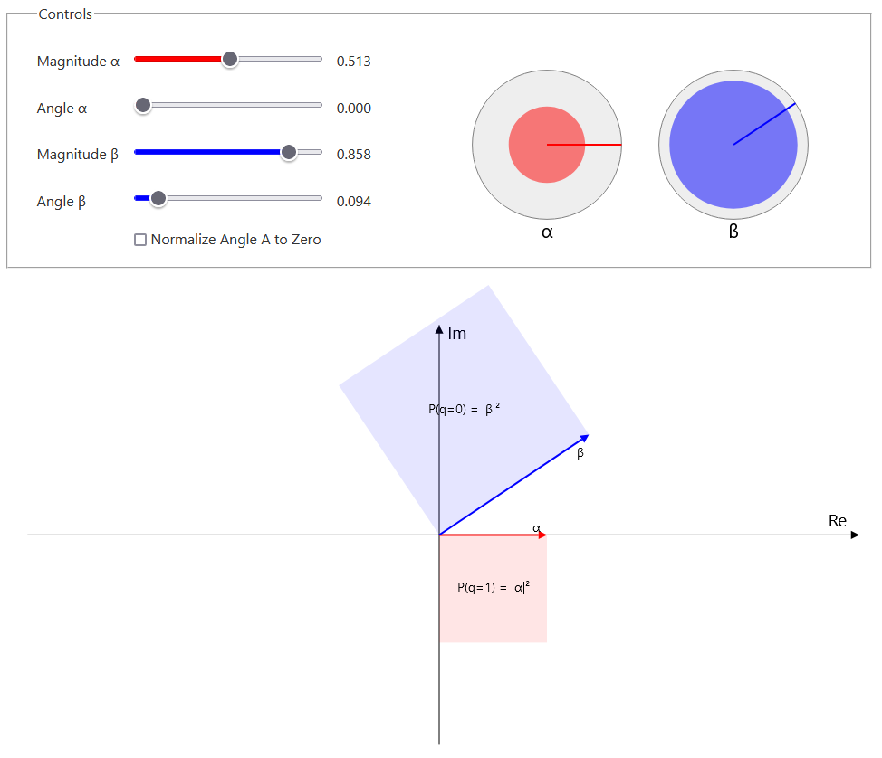

[Live Demo](https://static.laszlokorte.de/random-variables/)

# qBit representation

This illustration shows my current unterstanding of qbits based on <a href="https://www.youtube.com/watch?v=JWf_g_ForGk">this video from Prof. Dr. Edmund Weitz</a>.

A qbit is represented as two complex numbers. A constraint is that the squares of their magnitudes sum to 1. That is because their magnitude square represent the probability of the qbit eventually being measured as a 0 or a 1. So both probabilities together must sum to 1.

Physically the individual phases of the complex numbers can not be distinguished, only their relative offset. So typically the angle of one complex number is normalized to be 0 and the other is shifted accordingly.

The constraint to sum to 1 and the normalization of the angles reduce the degrees of freedom from 4 down to 2. So in princible a qbit can be represented by a single complex number that magnituede is less than or equal to 1.

Quantum gates can be used to transform such a qbit in differnt ways. Obviously only transformations that do not violate the stated contraints are allowed. Such Quantum gates can be composed into a circuit. The input and output of the circuit are qbits. But only a limited set of qbit configurations can be created as input and only qbits with |&alpha|=1 or |&beta|=1 can be measured as output. An output must be measured/sampled multiple times to estimate the true magnitude value.